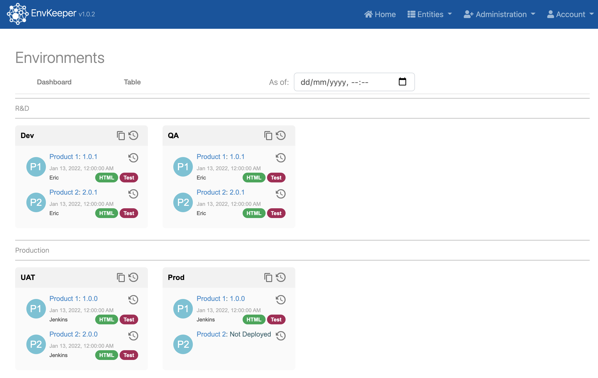

# EnvKeeper

Manage all your applications and environments in a central dashboard.



This application was generated using JHipster 6.10.3, you can find documentation and help at [https://www.jhipster.tech/documentation-archive/v6.10.3](https://www.jhipster.tech/documentation-archive/v6.10.3).

## TLDR / to install

### Without Azure Event Hubs Integration
1. Set SPRING_PROFILES_ACTIVE to ``prod,swagger`` or just ``prod`` in ``charts/envkeeper/templates/envkeeper-deployment.yml``.
2. Comment out setting ``EH_CNX_STRING`` in ``install.sh``
3. Update values.yaml
4. Run:
```shell
./install.sh
```

Log in with admin/admin or user/user. 

### With Azure Event Hubs integration
1. In your Azure subscription, create a ``my-azure-rg`` Azure resource group, ``build-notification`` Event Hubs namespace, ``listener`` Listen access policy, and ``build-notifications`` Event Hub.
2. Set the following environment variables:
```shell
export AZ_SUBSCRIPTION=12345678-1234-1234-1234-123456789012
export AZ_RESOURCE_GROUP=my-azure-rg
export EH_HUB_NS_NAME=build-notification
export EH_HUB_NS_ACCESS_POLICY=listener
export EH_HUB_NAME=build-notifications
```
3. Update values.yaml
4. Run:
```shell
./install.sh
```

Log in with admin/admin or user/user.

## Development

Before you can build this project, you must install and configure the following dependencies on your machine:

1. [Node.js][]: We use Node to run a development web server and build the project.
   Depending on your system, you can install Node either from source or as a pre-packaged bundle.

After installing Node, you should be able to run the following command to install development tools.
You will only need to run this command when dependencies change in [package.json](package.json).

```
npm install
```

We use npm scripts and [Webpack][] as our build system.

Run the following commands in two separate terminals to create a blissful development experience where your browser
auto-refreshes when files change on your hard drive.

```

./mvnw


npm start
```

Npm is also used to manage CSS and JavaScript dependencies used in this application. You can upgrade dependencies by
specifying a newer version in [package.json](package.json). You can also run `npm update` and `npm install` to manage dependencies.
Add the `help` flag on any command to see how you can use it. For example, `npm help update`.

The `npm run` command will list all of the scripts available to run for this project.

## Using Docker to simplify development (optional)

You can use Docker to improve your development experience. A number of docker-compose configuration are available in the [src/main/docker](src/main/docker) folder to launch required third party services.

For example, to start a postgresql database in a docker container, run:

```
docker-compose -f src/main/docker/postgresql.yml up -d
```

To stop it and remove the container, run:

```
docker-compose -f src/main/docker/postgresql.yml down
```

You can also fully dockerize your application and all the services that it depends on.
To achieve this, first build a docker image of your app by running:

```
./mvnw -Pprod,swagger verify jib:dockerBuild
```

Then run:

```
docker-compose -f src/main/docker/app.yml up -d
```

## Integrating with third party systems

EnvKeeper has the concepts of builds, component version, product versions, deployments and tickets.
Therefore, it is ideally integrated with your build, deployment and ticket systems.

Two APIs are provided:
* A REST API (with full swagger UI for easy development)
* An Event Hubs / Kafka API

### Using the REST API

Full swagger UI is available (log in as admin). A couple of examples follow.

#### How to create a product version by using the API
Post the following to /api/product-versions:

```
{
  "productShortName": "my-project",
  "version": "1.2.7",
  "components": [
    {
      "buildDurationMS": 200000,
      "buildStatus": "SUCCEEDED",
      "startTime": "2020-10-22T16:11:00.616Z",
      "endTime": "2020-10-22T16:11:01.616Z",
      "buildUrl": "https://www.google.ie/",
      "componentShortName": "test-component",
      "version": "1.2.3.8"
    }
  ]
}
```

Another /api/product-versions/bulk also exists in order to upload several product versions.


#### How to create a deployment by using the API
Post the following to /api/deployments:

```
{
  "startTime": "2020-10-18T14:43:32.337Z",
  "endTime": "2020-10-18T14:43:33.337Z",
  "environmentShortName": "INT",
  "product": {
    "shortName": "my-project"
  },
  "productVersionVersion": "2.0.0",
  "deploymentStatus": "SUCCEEDED",
  "user": "string",
  "namespace": "string",
  "buildUrl": "string",
  "url": "string",
  "testUrl": "string"
}
```

Another /api/deployments/bulk also exists in order to upload several deployments.

Possible values for ```deploymentStatus``` are:

```
DELETED
SUCCEEDED
FAILED_KEPT
FAILED_ROLLED_BACK
```

### Integrating with the Event Hubs / Kafka API

First make sure that you created the Event Hub and enabled it as detailed at the top of this document.

If running locally, you will need to update ```application.yaml``` with the following settings (at the top level):
```yaml
kafka:
  bootstrapAddress: <EventHubNamespaceHost>:9093
  eventHubsConnectionString: <EventHub Listener Shared Access Policy Key>
  eventHubsName: <EventHub name>
```

Remember to start EnvKeeper with the Kafka profile enabled:
```shell
export SPRING_PROFILES_ACTIVE=dev,swagger,kafka
mvn
```

#### To send a test payload

Make sure you update the urls in ``TOKEN`` and ``URL`` in the first two lines below.
A few example files have been provided as payload examples.

```shell
TOKEN=`az account get-access-token --resource=https://my-build-notification-ehns.servicebus.windows.net --query accessToken --output tsv`
URL="https://my-build-notification-ehns.servicebus.windows.net/my-build-notifications-eh/messages?timeout=60&api-version=2014-01"

curl -v -X POST ${URL} \
 -H "Authorization: Bearer ${TOKEN}" \
 -H 'Content-Type: application/atom+xml;type=entry;charset=utf-8' \
 --data "@notification-component.json"

curl -v -X POST ${URL} \
 -H "Authorization: Bearer ${TOKEN}" \
 -H 'Content-Type: application/atom+xml;type=entry;charset=utf-8' \
 --data "@notification-componentVersion.json"

curl -v -X POST ${URL} \
 -H "Authorization: Bearer ${TOKEN}" \
 -H 'Content-Type: application/atom+xml;type=entry;charset=utf-8' \
 --data "@notification-build.json"

curl -v -X POST ${URL} \
 -H "Authorization: Bearer ${TOKEN}" \
 -H 'Content-Type: application/atom+xml;type=entry;charset=utf-8' \
 --data "@notification-buildStep.json"

curl -v -X POST ${URL} \
 -H "Authorization: Bearer ${TOKEN}" \
 -H 'Content-Type: application/atom+xml;type=entry;charset=utf-8' \
 --data "@notification-buildStat.json"

curl -v -X POST ${URL} \
 -H "Authorization: Bearer ${TOKEN}" \
 -H 'Content-Type: application/atom+xml;type=entry;charset=utf-8' \
 --data "@notification-productVersion.json"

curl -v -X POST ${URL} \
 -H "Authorization: Bearer ${TOKEN}" \
 -H 'Content-Type: application/atom+xml;type=entry;charset=utf-8' \
 --data "@notification-productVersion-2.json"

curl -v -X POST ${URL} \
 -H "Authorization: Bearer ${TOKEN}" \
 -H 'Content-Type: application/atom+xml;type=entry;charset=utf-8' \
 --data "@notification-deployment.json"
```
